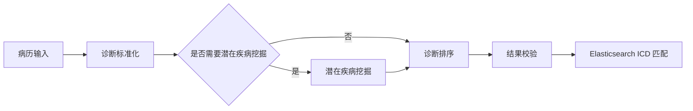

# ICD 智能编码系统

本项目面向住院病历的疾病与手术 ICD 辅助编码。系统通过多智能体工作流完成诊断提取、规范化、排序与校验，并结合 Elasticsearch 检索 ICD 编码。

> 系统输出仅供编码员辅助审核，不替代临床诊断或最终人工编码决策。请勿将患者隐私数据、运行结果或真实密钥提交到仓库。

## 架构

| 模块 | 作用 |
| --- | --- |
| `project_deploy/qy_icd` | Vue 前端与 Django 业务服务 |
| `project_deploy/Disease_ICD` | Flask 疾病 ICD 编码服务 |
| LangChain + LangGraph | Agent 编排、条件路由与会话状态管理 |
| Qwen3 模型服务 | 通过 OpenAI 兼容接口提供推理能力 |
| Elasticsearch | ICD 词条检索与匹配 |
| SQLite | 开发环境下的短期检查点与审核通过的长期编码经验 |

## 核心机制



- 通过 LangGraph 条件路由，仅在需要时执行潜在疾病挖掘。
- 工作流依次完成诊断标准化、主诊断排序和结果校验。
- 每个会话保留短期状态；人工审核通过的编码规则可作为长期经验被复用。
- 长期经验只应保存脱敏的规则或别名，不应保存原始病历和个人标识信息。

## 快速运行

### 1. 准备环境

建议使用 Python 3.10+，并先启动 Elasticsearch 与模型服务。

```bash
cd project_deploy/Disease_ICD
python3 -m venv .venv
source .venv/bin/activate
pip install -r requirements.txt
```

Windows PowerShell：

```powershell
cd project_deploy\Disease_ICD
py -m venv .venv
.\.venv\Scripts\Activate.ps1
pip install -r requirements.txt
```

### 2. 配置模型服务

默认需要以下 OpenAI 兼容接口：

| Agent | 默认端口 |
| --- | ---: |
| 诊断标准化 | 8004 |
| 主诊断排序 | 8008 |
| 结果校验 | 8007 |

潜在疾病判断与挖掘为可选服务：

```bash
export DISEASE_POTENTIAL_VERIFY_URL="http://localhost:8005/v1/chat/completions"
export DISEASE_POTENTIAL_EXTRACT_URL="http://localhost:8006/v1/chat/completions"
```

如需设置模型服务密钥，请使用环境变量 `LOCAL_LLM_API_KEY`，不要写入代码或提交到 Git。

### 3. 启动疾病 ICD 服务

```bash
cd project_deploy/Disease_ICD
bash run.sh
```

服务默认监听在 `http://localhost:5511`，疾病编码接口为：

```text
POST /qwen3/diagnosis_qwen
```

## 目录说明

```text
project_deploy/
├── Disease_ICD/       # 疾病 ICD 多智能体服务
├── Surgeries_ICD/     # 手术 ICD 服务
├── qy_icd/            # 前端与业务后端
└── PaddleOCR-main/    # OCR 能力
sft_agent/             # 微调模型及配置
es_save/               # ICD 索引与数据导入脚本
```

前端可在 `project_deploy/qy_icd/qianyi-web` 目录执行 `npm install` 和 `npm run dev` 启动。业务后端与生产部署配置请按实际数据库、模型服务和网络环境单独配置。
