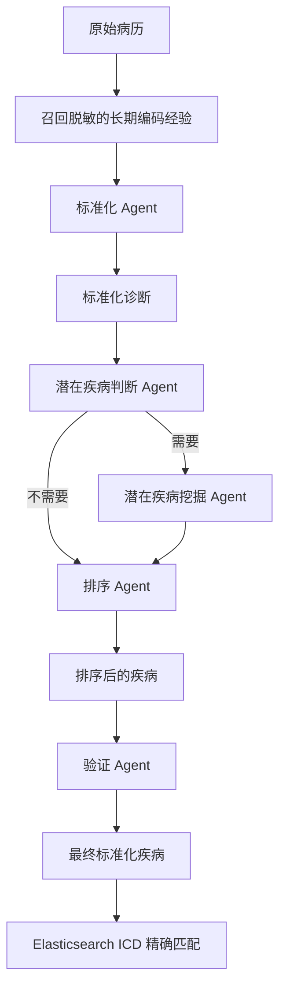

# ICD 智能编码系统

本项目面向住院病历的疾病与手术 ICD 辅助编码。

## 1. 系统架构



各节点职责：

1. **标准化 Agent**：输入完整病历，规范化病历中已经明确记录的诊断。
2. **潜在疾病判断 Agent**：输入病历和标准化诊断，决定是否需要潜在疾病挖掘。
3. **潜在疾病挖掘 Agent**：仅在条件分支为“有”时执行，抽取有病历证据支持但尚未进入诊断列表的疾病；不挖掘手术名称。
4. **排序 Agent**：输入病历、标准化诊断和潜在疾病，选择主要诊断并完成排序。
5. **验证 Agent**：输入病历和排序后的疾病，删除无依据项并输出最终标准化疾病。
6. **ICD 检索**：在 Elasticsearch 的 `icd_tree` 索引中匹配 ICD 编码并生成结果表格。

核心实现：

- `project_deploy/Disease_ICD/icd/disease/langgraph_workflow.py`：LangGraph 状态、节点、条件边和 LangChain LCEL 模型链。
- `project_deploy/Disease_ICD/icd/disease/memory.py`：长期记忆 SQLite 仓库与隐私校验。
- `project_deploy/Disease_ICD/icd/disease/GetICD.py`：保留原前端逐行 JSON 协议的兼容入口。

## 2. LangChain 和 LangGraph 如何使用

每个专业 Agent 都通过 LangChain LCEL 组成：

```text
ChatPromptTemplate | ChatOpenAI（本地 Qwen3 OpenAI 兼容接口） | StrOutputParser
```

LangGraph 用 `DiseaseWorkflowState` 在节点之间传递以下状态：

```text
medical_record
recalled_memories
standardized_diseases
need_potential_disease
potential_diseases
ranked_diseases
final_diseases
warnings
```

`potential_decision` 之后使用条件边：判断为“有”时进入
`potential_extract`，否则直接进入 `ranking`。这使潜在疾病挖掘不再是固定执行，
也不再像旧代码那样被硬编码为“无”。

## 3. 记忆机制

### 3.1 短期记忆

短期记忆使用 LangGraph `SqliteSaver`，数据库默认位于：

```text
project_deploy/Disease_ICD/data/memory/short_term_checkpoints.sqlite3
```

每个前端聊天会话会发送稳定的 `thread_id`。LangGraph 在每个节点后保存状态，
可用于同一病例的流程恢复、问题排查和状态回放。不同 `thread_id` 的病例彼此隔离。

清除某个会话的短期记忆：

```bash
curl -X DELETE http://localhost:5511/qwen3/short-term/diagnosis:SESSION_ID
```

### 3.2 长期记忆

长期记忆默认位于：

```text
project_deploy/Disease_ICD/data/memory/long_term_memory.sqlite3
```

它只保存人工审核通过的机构编码规则、疾病别名和纠错经验，跨 `thread_id` 复用。
工作流会按关键词召回最多 5 条规则，并把它们作为辅助上下文交给各 Agent。

长期记忆**不会自动保存原始病历或模型预测结果**，从而避免患者信息跨病例污染。
包含病案号、住院号、姓名、身份证号等明显患者标识的内容会被拒绝。

新增一条经过审核的长期记忆：

```bash
curl -X POST http://localhost:5511/qwen3/memories \
  -H "Content-Type: application/json" \
  -d '{
    "tenant_id": "default",
    "content": "不稳定型心绞痛与冠心病同时存在且本次因心绞痛住院时，优先审核心绞痛是否为主诊断。",
    "keywords": ["不稳定型心绞痛", "冠状动脉粥样硬化性心脏病"],
    "source": "coder_review",
    "approved": true
  }'
```

查询长期记忆：

```bash
curl "http://localhost:5511/qwen3/memories?tenant_id=default"
```

停用长期记忆：

```bash
curl -X DELETE "http://localhost:5511/qwen3/memories/MEMORY_ID?tenant_id=default"
```

生产环境应设置 `MEMORY_ADMIN_TOKEN`，调用上述管理接口时通过
`X-Memory-Admin-Token` 请求头传入；未设置时仅适合受控的本地开发环境。

## 4. 环境与安装

推荐 Python 3.10 或更高版本。

```bash
cd project_deploy/Disease_ICD
python3 -m venv .venv
source .venv/bin/activate
pip install -r requirements.txt
```

主要依赖：

- LangChain：模型适配、提示词模板和 LCEL 链。
- LangGraph：多智能体状态图、条件路由和检查点。
- Flask：HTTP 和流式响应服务。
- Elasticsearch：疾病名称到 ICD 编码的检索。
- SQLite：开发/单机部署的短期检查点和长期知识记忆。

## 5. 模型服务配置

现有三个疾病模型保持原端口：

| Agent | 默认端口 | 启动参数 |
|---|---:|---|
| 标准化 | 8004 | `disease_standardized_*` |
| 排序 | 8008 | `disease_main_diagnosis_*` |
| 验证 | 8007 | `disease_screening_*` |

潜在疾病模型通过环境变量配置：

```bash
export DISEASE_POTENTIAL_VERIFY_URL="http://localhost:8005/v1/chat/completions"
export DISEASE_POTENTIAL_VERIFY_MODEL="checkpoint-best"
export DISEASE_POTENTIAL_EXTRACT_URL="http://localhost:8006/v1/chat/completions"
export DISEASE_POTENTIAL_EXTRACT_MODEL="checkpoint-best"
```

然后运行：

```bash
cd project_deploy/Disease_ICD
bash run.sh
```

如果判断模型未配置，系统使用透明的关键词规则回退，并在结果中给出判断理由。
如果挖掘模型未配置，默认复用标准化模型执行潜在疾病提示词；可通过
`POTENTIAL_EXTRACTION_FALLBACK_AGENT` 改变回退模型。生产环境建议部署独立的
潜在疾病判断和挖掘模型。

可选环境变量：

| 变量 | 作用 | 默认值 |
|---|---|---|
| `LANGGRAPH_MEMORY_DIR` | 两类记忆数据库目录 | `Disease_ICD/data/memory` |
| `LOCAL_LLM_API_KEY` | 本地 OpenAI 兼容服务密钥 | `EMPTY` |
| `ICD_AGENT_TIMEOUT_SECONDS` | 单 Agent 超时 | `200` |
| `ICD_AGENT_MAX_RETRIES` | 单 Agent 重试次数 | `1` |
| `MEMORY_ADMIN_TOKEN` | 记忆管理接口令牌 | 未设置 |
| `ELASTICSEARCH_URL` | ICD 检索服务地址 | `https://127.0.0.1:9200/` |
| `ELASTICSEARCH_CA_CERT` | Elasticsearch CA 证书路径 | 项目内 `http_ca.crt` |
| `ELASTICSEARCH_USERNAME` | Elasticsearch 用户名 | 未设置 |
| `ELASTICSEARCH_PASSWORD` | Elasticsearch 密码 | 未设置 |

## 6. 调用接口

疾病编码接口保持不变：

```http
POST /qwen3/diagnosis_qwen
Content-Type: application/json
```

请求示例：

```json
{
  "thread_id": "diagnosis:session-001",
  "tenant_id": "default",
  "messages": [
    {
      "role": "user",
      "content": "{\"病案标识\":\"TEST001\",\"出院诊断\":\"急性阑尾炎\",\"现病史\":\"右下腹痛3天\",\"影像学意见\":\"阑尾增厚\"}"
    }
  ]
}
```

响应继续采用原前端兼容的逐行 JSON，包括 `status`、`agent_response` 和
`final_result`。每条响应同时返回 `thread_id`，方便排查和恢复状态。

## 7. 数据与安全建议

- 不要把患者姓名、身份证、手机号等信息写入长期记忆。
- `thread_id` 建议使用会话 UUID，不直接使用病案号。
- SQLite 适用于开发和单机部署；多实例生产环境建议将 LangGraph checkpointer
  与长期 store 迁移到 PostgreSQL，并启用静态加密、访问控制和数据保留策略。
- Elasticsearch、模型服务和记忆管理接口应部署在内网，并配置认证。
- `data/memory/*.sqlite3*` 和推理结果文件不应提交到 Git。

## 8. 项目边界

本次 LangGraph 改造覆盖用户指定的**疾病 ICD 主流程**。手术 ICD 仍保留原有
独立流程，其潜在手术挖掘不属于潜在疾病挖掘；后续可按同样方式封装为手术子图，
再由顶层路由图并行或按病历类型调度。
